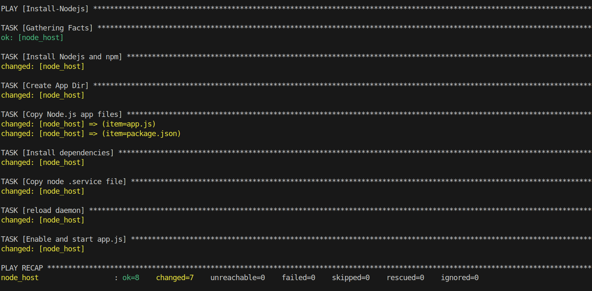
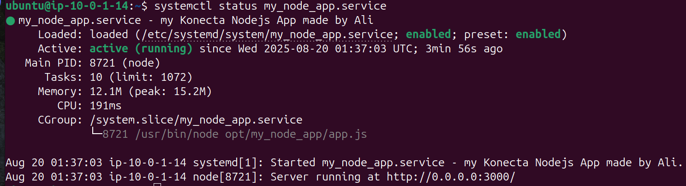
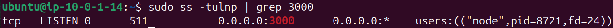
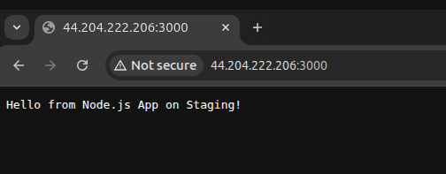

## `inventory.ini`

```
[node_server]
node_host ansible_host=44.204.222.206 ansible_user=ubuntu  ansible_ssh_private_key_file=~/Downloads/vockey3.pem 
```

---

## `app_deploy.yaml`

```yaml
- name: Install-Nodejs
  hosts: all
  become: yes

  tasks:
    - name: Install Nodejs and npm
      ansible.builtin.apt:
        name:
          - nodejs
          - npm
        state: present
        update_cache: true

    - name: Create App Dir
      ansible.builtin.file:
        path: /opt/my_node_app
        state: directory
        mode: '0755'
        
    - name: Copy Node.js app files
      ansible.builtin.copy:
        src: "files/{{ item }}"
        dest: "/opt/my_node_app/{{ item }}"
      loop:
        - app.js
        - package.json

    
    - name: Install dependencies  
      npm:
        path: /opt/my_node_app
    
    - name: Copy node .service file
      ansible.builtin.copy:
        src: templates/my_node_app.service.j2
        dest: /etc/systemd/system/my_node_app.service
    
    - name: reload daemon
      command: systemctl daemon-reload

    - name: Enable and start app.js
      systemd:
        name: my_node_app
        enabled: yes
        state: started
```

---

## `app.js`

```jsx
const http = require('http');

const hostname = '0.0.0.0'; // Listen on all interfaces
const port = 3000; // Or another port

const server = http.createServer((req, res) => {
  res.statusCode = 200;
  res.setHeader('Content-Type', 'text/plain');
  res.end('Hello from Node.js App on Staging!\n');
});

server.listen(port, hostname, () => {
  console.log(`Server running at http://${hostname}:${port}/`);
});
```

### `package.json`

```json
{
  "name": "simple-node-app",
  "version": "1.0.0",
  "description": "A simple Node.js web app for Ansible deployment",
  "main": "app.js",
  "scripts": {
    "start": "node app.js"
  },
  "dependencies": {}
}
```

## `my_node_app.service`

```
[Unit]
Description=my Konecta Nodejs App made by Ali
After=network.target

[Service]
Type=simple
User=ubuntu
ExecStart=/usr/bin/node opt/my_node_app/app.js
Restart=always

[Install]
WantedBy=multi-user.target
```

---

## ansible playbook output



---

## `my_node_app` status



---

## `sudo ss -tulnp | grep 3000`



---

## App on browser



---

## Playbook Explanation

- First of all i set `become = true` because all of the playbook task needed sudo permissions

### Install Nodejs and npm task

- Used `apt` module with `update_cache` parameter to update packages before installing nodejs and npm
- Verified the task by running `nodejs v` and `npm -v`

### Create App Dir task

- Used `file` module to make the directory and set its permission to 755, to enable write permission for the owner `ubuntu` as this user will be running the service and installing dependencies
- Verified the task by navigating to the directory

### Copy App files

- Simplified the execution by using Ansible `loops` to iterate on my app files being copied
- Verified the task by listing files in the `/opt/my_node_app` directory

### Install dependencies

- Used `npm` module in ansible to install the app’s dependencies
- Verified the task checking `packege-lock.json` exists in the app files or not

### Copy `.service` file

- Used `copy` ansible module
- Copying from local to remote must have `remote_src = false` (default)
- Verified by listing the `/etc/systemd/system/my_node_app.service` file

### reload `daemon`

- Used the `command` module to execute `systemctl daemon-reload`
- I couldn’t use the `systemd_service` module with`daemon_reload = true` parameter because the `my_node_app` service wasn’t recognized yet so we had to use the `command` module

### Enable and Start app service

- Used `systemd` module along with `enabled = yes` parameter and `state = started`
- Verified by running `systemctl status my_node_app` and made sure the service is active and running

### Note

- All verification methods can be done also by registering the task and using the debug module to print out the output