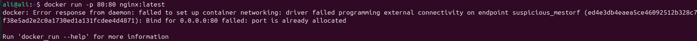
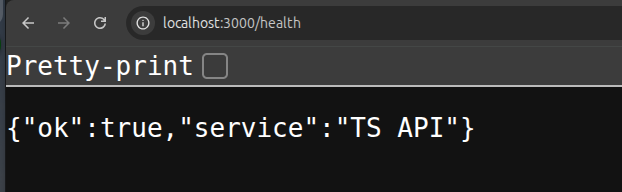

# Part 1 **Working with Docker Images**

### 1. **What is the difference between an image and a container?**

### Image

- An Image is immutable, once built, you cannot change it
- An Image is stateless, It has no state or information because it doesn’t have a runtime
- An Image lifecycle is it’s built from a Dockerfile, stored in you local registry then it can be pushed to any online registry (Dockerhub, ECR) and it can be pulled from those registries

### Container

- A Container is mutable, You can change files, install packages and do lots of action on a running container
- A Container is stateful, A running container has a runtime state, running processes and actual data stored in it or in attached volumes
- A Container’s lifecycle is it’s created from an image, runs its targeted process or command, can be started, stopped or deleted

---

## 2. **What happens if you run `docker run nginx` twice without removing the first container? Why?**

- Docker Create 2 Separate container running nginx
- This happens because Docker support container isolation, So it can create 2 identical individual container even if they are created from the same image
- Also because there is no conflicts between the 2 created containers like Port mapping

---

### 3. **Can two containers be created from the same image at the same time? What happens to their file systems?**

- Yes, Each Container will have its own file system independent from the other container’s file system

---

### 4. **What’s the difference between `docker image ls` and `docker ps`? When would you use each?**

- `docker image ls` lists all images available on your local machine.
- `docker ps` List all running containers on your machine

---

### 5. **What’s the purpose of tagging an image (e.g., `myapp:1.0`)? What happens if you don’t specify a tag?**

- Tagging helps in version control as each image has various deployments for new features or fixes
- Also tagging can help in rolling back to a healthy or working version of the image
- If we don’t specify tags, docker will assume it’s the `latest` tag of the image
- This `latest` tag doesn’t necessarily mean the latest image, it can point to old versions, so you will be lost without a tag

---

### 6. **How does Docker know which image to use when you run `docker run ubuntu`?**

- Docker assume this is `ubuntu:latest` since there is no tag on it
- First Docker checks for local images for the specified image
- If it doesn’t exist locally, Docker pulls it from the default source `Dockerhub`

---

### 7. **If you delete a container, does it delete the image too? Why or why not?**

- No, it only deletes the container
- This happens because a container is an instance that uses an image as its base layer, so a container is independant from an image, as other containers can be created from the same image

---

### 8. **What does this command do?**

```bash
docker pull ubuntu && docker run -it ubuntu
```

- The first part pull or downloads the image from Dockerhub
- The Second part run the container in interactive mode, so it will open the container’s shell as root user in the root directory

---

### 9. **You have a local image `nginx:latest`. What happens if you run `docker pull nginx` again? Will it download the image again? Why or why not?**

- Docker compares the hash between the local one and the one in dockerhub, if they are the same, there will be no changes
- If they are different hashes, Docker pulls only the new layers from the new image on dockerhub

---

### **10.What’s the difference between these two commands:**

```bash
docker rmi nginx
docker image prune
```

- `docker rmi nginx` deletes nginx image only
- `docker image prune` deletes all dangling images (images with no names or tags, result from build and overwriting an existing tag)
    - For example you already have an image called `nginx:latest` and you change the dockerfile and build the image with the same name and tag

---

### 11. **True or False:** Docker images can be shared between different operating systems.

- True
- But with some limitation like:
    - CPU Architecture: ARM or amd64
    - Compatiblity: Images only for windows or Linux

---

### 13. **What is the result of this command? Why might you use it?**

```bash
docker save -o backup.tar nginx
```

- This saves an image locally to restore later with `docker load -i backup.tar`
- It’s also used when you don’t want to use a registry like dockerhub or ECR
- It can be useful if the target machine has no internet access and you want to use docker images on it

---

### **14. How can you copy an image from one machine to another without using Docker Hub or a registry?**

- Use `docker save` and `docker load`
- Save the image

```bash
docker save -o myapp.tar myapp:1.0
```

- Copy it to another machine

```bash
scp myapp.tar user@target:/dir/myapp.tar
```

- Load the image on the target machine

```bash
docker load -i /dir/myapp.tar
```

---

### 15. **How do you inspect the internal metadata of an image? What kind of information can you find?**

```bash
docker image inspect nginx:latest
```

### Information

- ID
- Image tag
- Envs
- Work Directory
- Ports
- Image Size
- OS and Architecture
- Each layer hash
- Author
- Comments
- Creation time

---

# Part 2 **Networking and Bridge Mode**

### **1. Run two containers without specifying a network: Try to ping `container1` from `container2`:** What happens? Why?

### Answer

- No response
- Because the default network (bridge) DNS-based name resolution is not enabled.

### 2. **Inspect the `docker0` bridge network and check container IPs: Now try pinging `container1` from `container2` using IP address.**

### Answer

- It pings successfully, because the 2 IP addresses are in the same network (bridge network)

---

# Part 3 Port Forwarding

1. **Run an Nginx container with port forwarding:**
2. **Access the container from the browser or using `curl`:**
3. **Try running a second Nginx container with the same port mapping. What happens? Why?**

### Answer

- the second container failed to be created because the port is already allocated
- Error



---

# Docker Volume

```bash
FROM alpine:latest

RUN apk add --no-cache curl

RUN echo "Hello from container!" > /hello

CMD ["cat", "/hello"]
```

### Bind Mount

```bash
docker run -it --rm \
  -v /home/ali/docker_task/data_bind:/app/data \
  my-basic-image:v1 sh
```

- Change is synced with the host

### **Named Volume**

- Create a named volume called `my_named_volume`.

```bash
docker volume create my_named_volume
```

- Run the container using this named volume mounted at `/app/named`.

```bash
docker run -it --rm \
  -v my_named_volume:/app/named \
  my-basic-image:v1 sh
```

- Create a file inside `/app/named` from inside the container and check it persists after container deletion.
- >> File persist after deletion

---

### **Anonymous Volume**

- Run the container with an anonymous volume mounted at `/app/anon`.

```bash
docker run -it --rm \
  -v /app/anon \
  my-basic-image:v1 sh
```

- Verify the anonymous volume is created by listing all volumes after the container starts.

```bash
docker volume ls
```

---

# Dockerfile task

```docker
FROM node:20

WORKDIR /app

COPY package*.json tsconfig.json ./

RUN npm install

COPY . .

RUN npm run build

EXPOSE 3000

CMD ["npm", "run", "start"]

```

### Run the container

```bash
docker run -p 3000:3000 my-ts-app:v1
```

### Output

