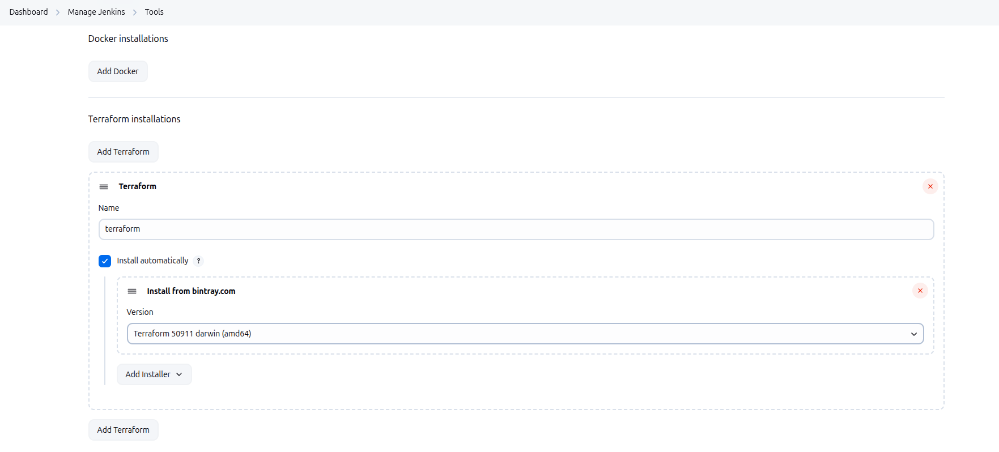
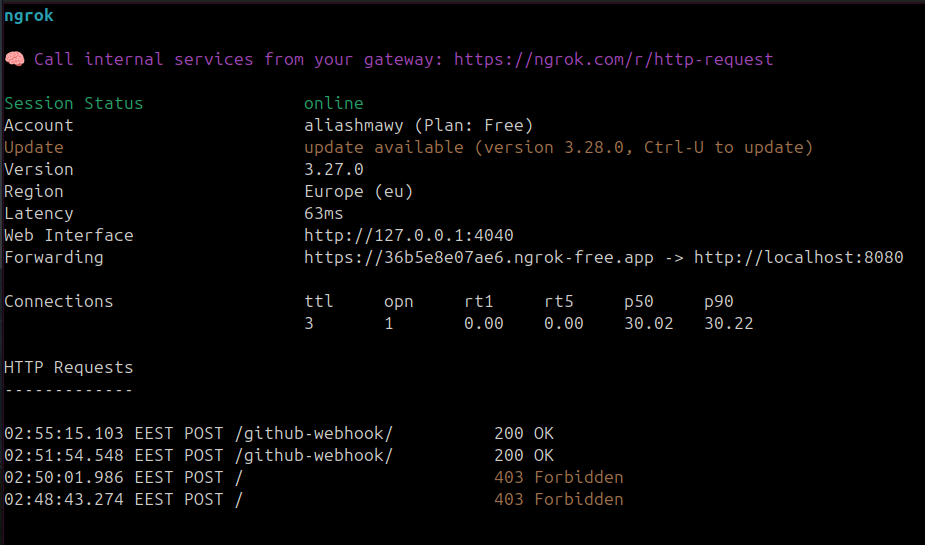
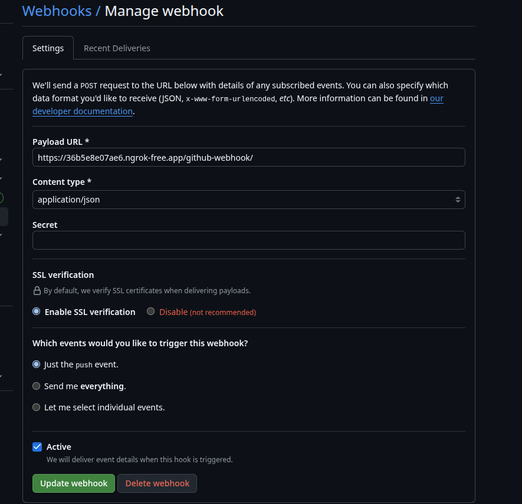
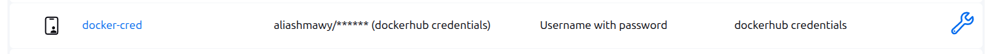
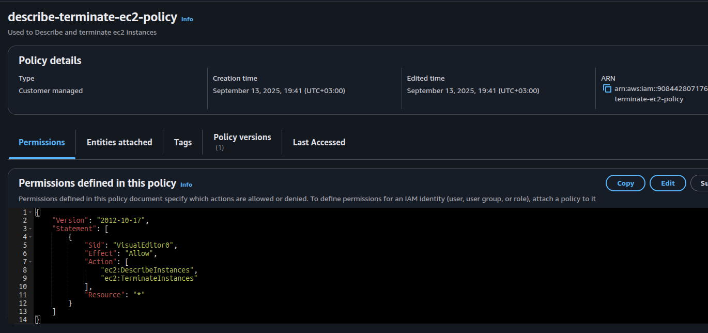
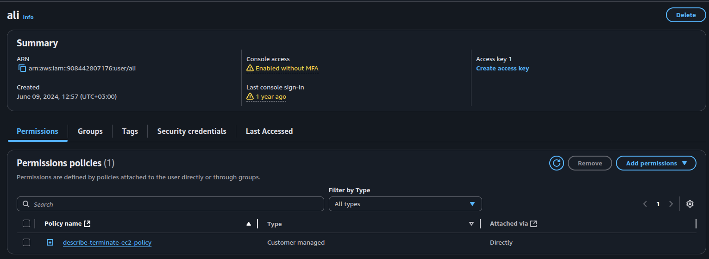
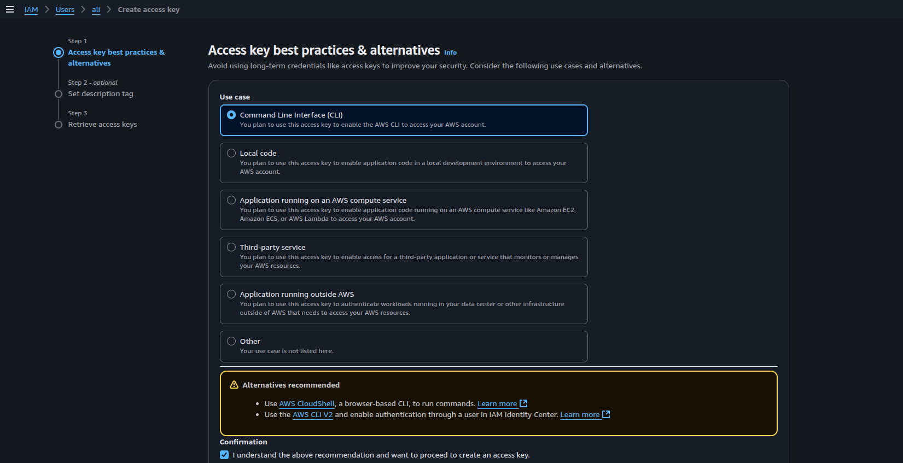
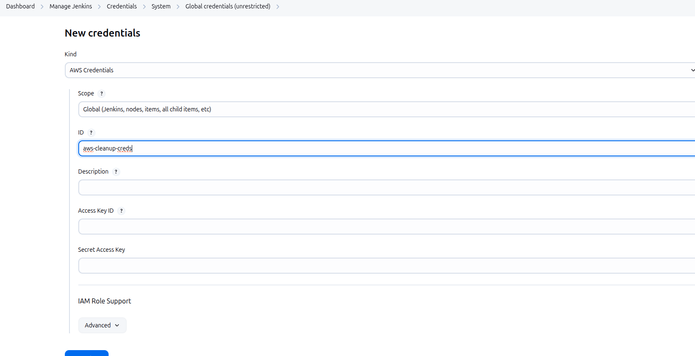
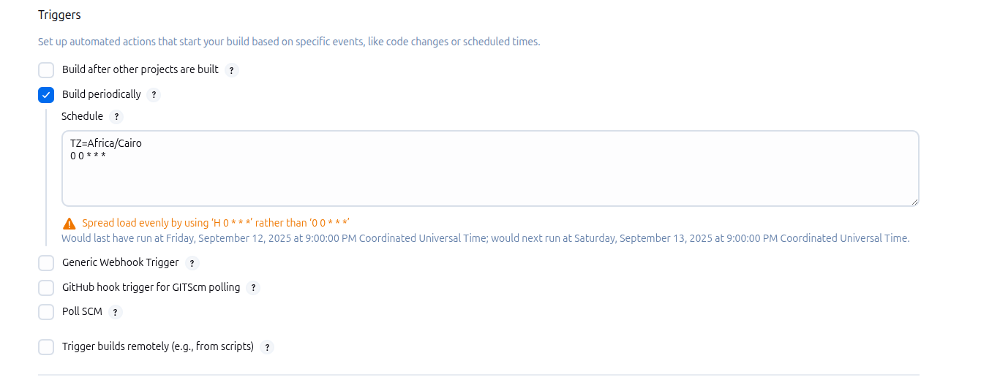

# Pipeline 1

## Terraform files

- [Terraform Files](terraform/)

---

## Ansible

### `playbook.yaml`

- I Used `ansible_distribution_release` variable from `ansible facts` to find the exact release to use when adding the apt repo

```yaml
- name: Install Docker
  hosts: all
  become: true
  tasks:
    - name: Install prerequisites for Docker repository
      apt:
        name: ['apt-transport-https', 'ca-certificates', 'curl', 'gnupg2', 'software-properties-common']
        update_cache: yes

    - name: Add Docker GPG key
      apt_key:
        url: https://download.docker.com/linux/ubuntu/gpg

    - name: Add Docker APT repository
      apt_repository:
        repo: deb [arch=amd64] https://download.docker.com/{{ ansible_system | lower }}/{{ ansible_distribution | lower }} {{ ansible_distribution_release }} stable

    - name: Install Docker CE
      apt:
        name: ['docker-ce', 'docker-ce-cli', 'containerd.io']
        update_cache: yes

    - name: Start Docker service
      service:
        name: docker
        state: started
        enabled: yes
```

### `inventory.yaml`

- Used AWS dynamic inventory to detect instances with matching tags

```yaml
---
plugin: aws_ec2
regions:
  - us-east-1
filters:
  tag:Name: ci-ephemeral
```

---

## Pipeline

### Pre-requisites

### AWS Credentials

- Pass Access key and secret key of AWS as `secret text` in jenkins credentials and passing them as `environment` in the `jenkinsfile`

### EC2 Credentials

- Created `SSH Username with private key` Credentials to use in `sshUserPrivateKey` tool to ssh the EC2 in the ansible command

---

### Tools

- Install Terraform and Ansible Plugins and make installations for both of them



### Note

- This installation is used if you want to manage or use different version of your tool, so you make different installations for them in jenkins
- You can use specific version from a tool in your pipeline like this

```groovy
pipeline {
  agent any
  tools {
    ansible 'Ansible-2.15'   // the name you gave in Global Tool Config
  }
```

---

### Exposing jenkins

- using ngrok



### Adding Webhook



---

### Plugins

- Used `Credentials Binding Plugin` to use the `withCredential` tool

### Pipeline


```groovy
pipeline {
  agent any

  environment {
    TF_DIR = 'pipeline1/terraform'
    ANSIBLE_DIR = 'pipeline1/ansible'
    AWS_ACCESS_KEY_ID = credentials('access_key')
    AWS_SECRET_ACCESS_KEY = credentials('secret_key')
  }

  stages {
    stage('Clean Workspace') {
      steps {
        deleteDir()
      }
    }

    stage('Checkout') {
      steps {
        checkout scm
      }
    }

    stage('Terraform Init') {
      steps {
        dir("${TF_DIR}") {
          sh 'terraform init'
        }
      }
    }
    
    stage('Terraform Validate'){
      steps {
        dir("${TF_DIR}") {
          sh 'terraform validate'
        }
      }
    }

    stage('Terraform Plan') {
      steps {
        dir("${TF_DIR}") {
          sh 'terraform plan -out=tfplan'
        }
      }
    }

    stage('Terraform Apply') {
      steps {
        dir("${TF_DIR}") {
          sh 'terraform apply -auto-approve tfplan'
        }
      }
    }
    stage('Pass EC2 IP to Pipeline 2') {
    steps {
        dir("${TF_DIR}") {
        script {
            def ec2_ip = sh(script: "terraform output -raw public_instance_ip", returnStdout: true).trim()
            echo "EC2 IP is ${ec2_ip}"

            build job: 'pipeline2-konecta',
                  parameters: [string(name: 'ec2_ip', value: ec2_ip)],
                  wait: false
        }
        }
    }
}
    stage('Run Ansible') {
      steps {
        withCredentials([sshUserPrivateKey(credentialsId: 'ephemeral-instance',
                                          keyFileVariable: 'SSH_KEY_FILE',
                                          usernameVariable: 'SSH_USER')]) {
          dir("${ANSIBLE_DIR}"){
          sh '''
            chmod 600 "$SSH_KEY_FILE"
            ansible-playbook -i inventroy_aws_ec2.yaml --private-key "$SSH_KEY_FILE" -u "$SSH_USER" playbook.yaml
          '''
        }
        }
      }
    }
  }
}
```

---

# Pipeline 2

## Passing IP Parameter

- In the upstream pipeline `pipeline.provision`, defined a function to output the ec2 IP in a variable called `ec2_ip`
- Then Created a downstream job trigger using this variable as a parameter like so
- the `wait: true` to wait for the upstream pipeline to finish so, the second pipeline will have docker ready to be able to execute docker commands

```groovy
build job: 'pipeline2-konecta',
                  parameters: [string(name: 'ec2_ip', value: ec2_ip)],
                  wait: true
```

- Then passed the parameter in the `pipeline.deploy`

```groovy
parameters {
        string(name: 'ec2_ip', defaultValue: '', description: 'Public IP of target EC2 (from Pipeline 1)')
    }
```

---

## Pipeline Prerequisites

### Docker hub Credentials

- Configured Docker hub credentials in jenkins as `Username and password` to use in `withCredentials([usernamePassword`



---

### SSH Credentials

- Used Previously defined Credentials for the first pipeline to ssh on the EC2 in this pipeline

---

### Pipeline

```groovy
pipeline {
    agent any

    parameters {
        string(name: 'ec2_ip', defaultValue: '', description: 'Public IP of target EC2 (from Pipeline 1)')
    }

    environment {
        DOCKER_IMAGE = "docker.io/aliashmawy/nginx-ci:${BUILD_NUMBER}"
        DOCKER_DIR = 'pipeline1/'
    }

    stages {
        stage('Clean Workspace') {
      steps {
        deleteDir()
      }
    }
        stage('Checkout') {
            steps {
                checkout scm
            }
        }

        stage('Build Docker Image') {
            steps {
                dir("${DOCKER_DIR}") {
                script {
                    def timestamp = sh(script: "date +%Y-%m-%d_%H-%M-%S", returnStdout: true).trim()
                    sh """
                        echo '<h1>Build: ${BUILD_NUMBER}</h1><p>Timestamp: ${timestamp}</p>' > index.html
                        docker build -t ${DOCKER_IMAGE} .
                    """
                }
            }
            }
        }

        stage('Push to Docker Hub') {
            steps {
                echo "docker push is running now"
                withCredentials([usernamePassword(credentialsId: 'docker-cred', usernameVariable: 'USERNAME', passwordVariable: 'PASSWORD')]) {
                    sh "echo $PASSWORD | docker login -u $USERNAME --password-stdin"
                    sh "docker push ${DOCKER_IMAGE}"
            }
        }
        }

        stage('Deploy to EC2') {
            steps {
                withCredentials([
                    sshUserPrivateKey(credentialsId: 'ephemeral-instance',
                                    keyFileVariable: 'SSH_KEY_FILE',
                                    usernameVariable: 'SSH_USER'),
                    usernamePassword(credentialsId: 'docker-cred',
                                usernameVariable: 'USERNAME',
                                passwordVariable: 'PASSWORD')
                ]) {
                    sh """
                        ssh -o StrictHostKeyChecking=no -i "\$SSH_KEY_FILE" "\$SSH_USER"@${params.ec2_ip} '
                            echo "Logging into Docker Hub..."
                            echo ${PASSWORD} | docker login -u ${USERNAME} --password-stdin
                            
                            echo "Stopping existing container..."
                            docker rm -f web || true
                            
                            echo "Pulling and running new container..."
                            docker run -d --name web -p 80:80 ${DOCKER_IMAGE}
                        '
                    """
        }
    }
}

        stage('Verify Deployment') {
            steps {
                sh """
                    curl -s http://${params.ec2_ip}
                """
            }
        }
    }
}
```

---

# Pipeline 3

## Prerequisites

### IAM Least Privilege

### Configuring Policy to describe and terminate EC2s



### Attach Policy To IAM User



### Create CLI Access Credentials



### Configure AWS Credentials

- First you have to download AWS Credentials Plugin



---

## Scheduled Trigger



---

### Pipeline

- This pipeline use the `aws ec2 describe-instances` output (`reservations.instances.instancesid`)
- If Found, Inputs it in the `aws ec2 terminate-instances` command

```groovy
pipeline {
    agent any

    stages {
        stage('Cleanup Ephemeral EC2s') {
            steps {
                withAWS(credentials: 'aws-cleanup-creds', region: 'us-east-1') {
                    sh '''
                        INSTANCE_IDS=$(aws ec2 describe-instances \
                          --filters "Name=tag:lifespan,Values=ephemeral" \
                                    "Name=instance-state-name,Values=pending,running,stopping,stopped" \
                          --query "Reservations[].Instances[].InstanceId" \
                          --output text)

                        if [ -n "$INSTANCE_IDS" ]; then
                          aws ec2 terminate-instances --instance-ids $INSTANCE_IDS
                          echo " Terminated instances: $INSTANCE_IDS"
                        else
                          echo "ℹ No ephemeral instances found."
                        fi
                    '''
                }
            }
        }
    }
}
```