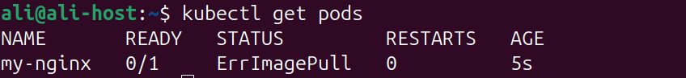
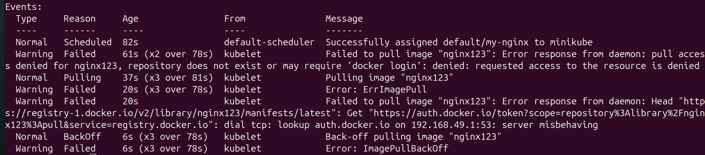
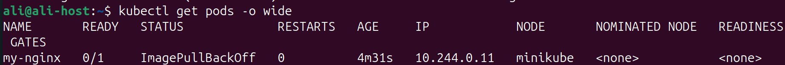

### 1. Create Nginx Pod using command line

```bash
kubectl run my-nginx --image nginx
```

---

### 2. Create Nginx Pod using nginx123 image

```bash
kubectl run my-nginx --image nginx123
```

---

### 3. Check Status and why it doesn’t work



- Using describe command

```bash
kubectl describe pod my-nginx
```



- The Error indicated that there is no image with the name `nginx123`

---

### 4. I need to know node name - IP - Image Of the POD

- You can use `-o wide`

```bash
kubectl get pods -o wide
```



---

### 5. Delete the Pod

```bash
kubectl delete pod my-nginx
```

---

### 6. create another one with yaml file and use label

```yaml
apiVersion: v1
kind: Pod
metadata:
  name: my-nginx
  labels:
	  app: myapp
	  type: front-end
spec:
  containers:
  - name: nginx
    image: nginx

```

---

### 7. create Replica set with 3 replicas using nginx Image

```yaml
apiVersion: apps/v1
kind: ReplicaSet
metadata:
  name: my-nginx
  labels:
    app: nginx
    tier: frontend
spec:
  replicas: 3
  selector:
    matchLabels:
      tier: frontend
  template:
    metadata:
      labels:
        tier: frontend
    spec:
      containers:
      - name: my-nginx
        image: nginx

```

---

### 8. scale the replicas to 5 without edit in the Yaml file

```yaml
kubectl scale --replicas=5 -f my-nginx.yml
```

- OR

```yaml
kubectl scale --replicas=5 replicaset my-nginx
```

---

### 9. Delete any one of the 5 pods and check what happen and explain

- After Deletion, I noticed that another was created right away
- This Happened because replica sets ensures that a specified number of pod replicas are running at any given time.

---

### 10. Scale down the pods aging to 2 without scale command use terminal

- I can edit the yaml file and make number of replicas = 2, then use the `replace` command

```bash
kubectl replace -f my-nginx.yaml
```

- Or i can use the `edit` command and edit the number of replicas

```bash
kubectl edit rs my-nginx
```

---

### 11. find out the issue in the below Yaml (don't use AI)

- The Issue is in the Value of the label in the `.spec.selector.matchLabels` part, it should be `tier: nginx` to match the Pod Label
- Correct yaml file

```yaml
apiVersion: apps/v1
kind: ReplicaSet
metadata:
  name: replicaset-2
spec:
  replicas: 2
  selector:
    matchLabels:
      tier: nginx
  template:
    metadata:
      labels:
        tier: nginx
    spec:
      containers:
      - name: nginx
        image: nginx
```

---

### 12. find out the issue in the below Yaml (don't use AI)

- The Issue is in the `kind` name should be `Deployment` not `deployment`
- Didn’t notice it, until i tried to create the file and error said no kind `deployment` is registered under `apps/v1`
- Correct yaml file

```yaml
apiVersion: apps/v1
kind: Deployment
metadata:
  name: deployment-1
spec:
  replicas: 2
  selector:
    matchLabels:
      name: busybox-pod
  template:
    metadata:
      labels:
        name: busybox-pod
    spec:
      containers:
      - name: busybox-container
        image: busybox
        command:
        - sh
        - "-c"
        - echo Hello Kubernetes! && sleep 3600
```

---

### 13. find out the issue in the below Yaml (don't use AI)

- The Issue was the `apiVersion` was incorrect
- Correct yaml file

```yaml
apiVersion: apps/v1
kind: Deployment
metadata:
  name: deployment-1
spec:
  replicas: 2
  selector:
    matchLabels:
      name: busybox-pod
  template:
    metadata:
      labels:
        name: busybox-pod
    spec:
      containers:
      - name: busybox-container
        image: busybox
        command:
        - sh
        - "-c"
        - echo Hello Kubernetes! && sleep 3600
```

---

### 14. what's command you use to know what Image name that running the deployment

- `describe` command used to describe deployment command

```bash
kubectl describe deployment deployment-1
```

---

### 15. create deployment using following data

```yaml
apiVersion: apps/v1
kind: Deployment
metadata:
  name: httpd-frontend
spec:
  replicas: 3
  selector:
    matchLabels:
      name: busybox-pod
  template:
    metadata:
      labels:
        name: busybox-pod
    spec:
      containers:
      - name: httpd-container
        image: httpd:2.4-alpine
```

---

### 16. replace the image to nginx777 with command directly

```bash
kubectl set image deployment/deployment-1 busybox-container=nginx777
```

---

### 17. rollback to pervious version

```bash
kubectl rollout undo deployment deployment-1
```

---

### 18. Push image to Dockerhub

- I just use the `nginx:alpine` image and change its tag using `docker tag`

```bash
docker tag nginx-image:latest aliashmawy/nginx-image
```

- Push command

```bash
docker push aliashmawy/nginx-image
```

---

### 19. Create a Deployment Using This Image

```yaml
apiVersion: apps/v1
kind: Deployment
metadata:
  name: nginx-frontend
spec:
  replicas: 3
  selector:
    matchLabels:
      name: frontend
  template:
    metadata:
      labels:
        name: frontend
    spec:
      containers:
      - name: my-nginx
        image: aliashmawy/nginx-image:latest
```

---

### 20. Expose the Frontend (FE) Using Service to make it accessible from your browser

- Make a Service

```yaml
apiVersion: v1
kind: Service
metadata:
  name: myapp-service
spec:
  type: NodePort
  ports:
    - port: 80
      targetPort: 80
      nodePort: 30008
  selector:
    name: frontend
```

- Expose it using `minikube` and use the IP:Port to access the frontend

```bash
minkube service myapp-service --url
```

- OR use `port-forwarding` command and access the frontend directly using `localhost:9090`

```bash
kubectl port-forward --address 0.0.0.0 svc/myapp-service  9090:80 &
```

---

### 21. Create a Backend (BE) Deployment

```yaml
apiVersion: apps/v1
kind: Deployment
metadata:
  name: backend
spec:
  replicas: 2
  selector:
    matchLabels:
      name: backend
  template:
    metadata:
      labels:
        name: backend
    spec:
      containers:
      - name: backend
        image: python:3.8-slim
        command: ["python", "-m", "http.server", "8080"]
```

---

### 22. Expose the Backend Internally Using Service

```bash
kubectl expose deployment backend --name=backend-service --port=8080 --target-port=8080
```

---

### 23. Create a LoadBalancer Service

- When it gets created, the service stays in a `pending` state, due to no integration with a cloud provider

```yaml
apiVersion: v1
kind: Service
metadata:
  name: lb-service
spec:
  type: LoadBalancer
  selector:
    name: frontend
  ports:
    - port: 80
      targetPort: 80
```

---

### 24. Explain DaemonSets

- DaemonSets are created to ensure one copy of the Pod is always present in each node in the cluster
- So if the node is removed, The Pod gets deleted automatically

### **Use Case:**

- A kube-proxy for each node
- A log collector for each node
- A monitoring app container for each node
- An external networking solution to be installed on each node

```yaml
apiVersion: apps/v1
kind: DaemonSet
metadata:
  name: monitoring-app
spec:
  template:
    metadata:
      name: redis
      labels:
        type: monitor
    spec:
      containers:
      - name: monitroing-agent
        image: monitroing-agent
  selector:
    matchLabels:
      type: monitor

```

---

### 25. List the Components of the ** Master node ** and what is the purpose of each component

### API Server:

- Acts as the front end for kubernetes
- Users management devices, CLIs interact with the cluster trough API server
- Authenticate Users
- Validate requests
- Retrieve data from etcd

---

### etcd key store:

- Store key-value meta-data that is used by kubernetes to manage a cluster
- So all the information about all nodes and masters for a cluster is stored in etcd

---

### Scheduler:

- a control plane process which assigns Pods to Nodes.
- The scheduler determines which Nodes are valid placements for each Pod in the scheduling queue according to constraints and available resources.
- The scheduler then ranks each valid Node and binds the Pod to a suitable Node
- If a node reached more than 80% of its resources, the scheduler won’t assign pods to it (the percentage can be altered based on your needs)

---

### Controller:

- They are responsible for responding when nodes, containers or end points goes down
- They bring up new containers
- Monitors node very 5 seconds (default period)
- Maximum period for monitoring is 40 seconds if there is no response
- POD eviction timeout is 5 minutes (convert its status as not ready)

---

### 26. List  the Components of the ** Worker node ** and what is the purpose of each component

### Container runtime:

- The underlying software that is used to run containers
- Like Docker Runtime

---

### Kubelet:

- It’s the agent that runs on each node in the cluster
- It makes sure that the containers are running on nodes as expected
- Report status back to the master

---

### Kubeproxy:

- Manages Worker nodes networking

---