## 1. Explain `/etc/passwd` fields

- Let’s take this line for example

```bash
ali:x:1000:1000:ali:/home/ali:/bin/bash
```

1. ali > username
2. x > encrypted password
3. 1000 > User ID for ali
4. 1000 > Group ID for ali
5. ali > comment created using `useradd -c`
6. `/home/ali` > home directory
7. `/bin/bash` > path of the shell used by user ali

---

## 2. `cat` vs `more`

### `cat`

- Used to display all the contents of the file
- Perfect for small text files
- Example: `cat /etc/netplan/50-cloud-init.yaml`

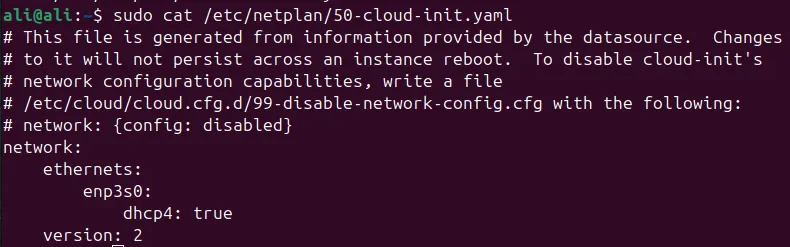

### `more`

- Used to display contents of a file one screen at a time
- So If the contents of the file fit a single screen, the output will be the same as the `cat` command.
- `space` key is used to scroll page by page
- `enter` key is used to scroll line by line
- Example: `more /etc/passwd`

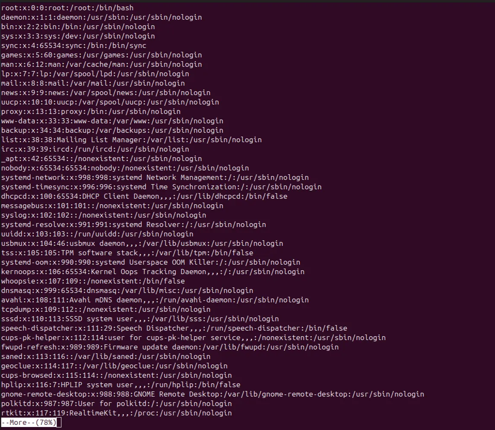

---

## 3. `rm` vs `rmdir`

### `rm`

- Can delete files and directories (empty and not empty using `rm -r` )

### `rmdir`

- Can only delete empty directories
- Used for safety reasons if there is any hidden files or sub-directories

---

## 4. try to remove `dir11` using `rmdir`

- Error:

```bash
ali@ali:~$ rmdir dir11
rmdir: failed to remove 'dir11': Directory not empty
```

- We should use `rm -r` to remove the directory because it’s not empty

```bash
rm -r dir11
```

---

## 5. Try to remove `dir12` using `rmdir -p`

- If `dir11` exists then only `dir12` will be deleted

```bash
ali@ali:~$ rmdir -p dir1/dir12
rmdir: failed to remove directory 'dir1': Directory not empty
```

- If `dir11` doesn’t exist then `dir12` and its parent `dir1` will be deleted

### Note

- The `-p` deletes parent directories if the parent directory is used in the command
- `rmdir -p dir12` deletes only `dir12` even if its parent is empty
- `rmdir -p dir1/dir12` deletes `dir12` and `dir1` both

---

## 6. Copy `/etc/passwd` to your home directory and rename it to `mypassword`

```bash
cp /etc/passwd $Home/mypassword
```

---

## 7. Rename `mypassword` to `oldpasswd`

```bash
mv ~/mypassword ~/oldpasswd
```

---

## 8. Explain the fields in the `/etc/shadow` file

- Let’s take this line for example

```bash
ali1:$6$4...:20313:0:99999:7:::

```

1. **ali1** > username
2. **$6$4..** > account password in a hashed format, ($6$ means it uses `SHA-512`)
3. **20313** > Last password change, this expressed by the number of days since Jan 1, 1970
4. **0** > minimum number of days required between password changes (can’t change password before this period ends)
5. **99999** > maximum number of days that the password is valid, after that period password must be changed
6. **7** > A warning will appear 7 days before your password expiration time
7. **Inactive** > The number of days after password expires that account is disabled.
8. **Expire >** The date of expiration of the account, expressed as the number of days since Jan 1, 1970.

---

## 9. List all available Unix shells (from /etc/shells).

- `/bin/sh`
- `/usr/bin/sh`
- `/bin/bash`
- `/usr/bin/bash`
- `/bin/rbash`
- `/usr/bin/rbash`
- `/usr/bin/dash`

### Note

- `/bin` is just a soft link for `/usr/bin`

---

## 10. From `/usr/bin`, list 4 different ways to go back to your home directory.

- `cd`
- `cd ~`
- `cd $HOME`
- `cd /home/ali`

---

## 11. Display the first 4 lines of `/etc/passwd`.

```bash
head -n 4 /etc/passwd
```

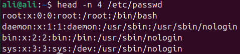

---

## 12. Display the last 7 lines of /etc/passwd.

```bash
tail -n 7 /etc/passwd
```

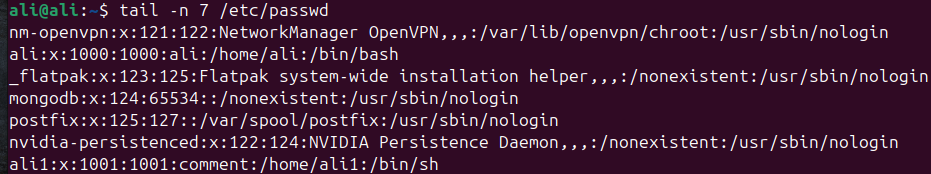

---

## 13. Display who is currently logged in

```bash
who
#OR
users
```

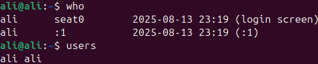

---

## 14. Display the number of user accounts in the system.

- This includes regular and system user accounts

```bash
cat /etc/passwd | wc -l
```

---

## 15. Create user

- Create user islam with a comment

```bash
sudo useradd -c "Islam Askar" islam
```

- Add password

```bash
sudo passwd islam
```

---

## 16. Create another user

- Create user baduser with a comment

```bash
sudo useradd -c "bad user" baduser
```

- Add password

```bash
sudo passwd baduser
```

---

## 17. Create a group called `pgroup` with GID 30000

```bash
sudo groupadd -g 30000 pgroup
```

---

## 18. Create a group called `badgroup`

```bash
sudo groupadd badgroup
```

---

## 19. Add islam to the `pgroup` group as a secondary group.

```bash
sudo usermod -aG pgroup islam
```

---

## 20. Change islam’s password to password.

```bash
sudo passwd islam
```

---

## 21. Set islam’s password to expire after 30 days.

- Set Maximum period for password to be valid

```bash
sudo chage -M 30 islam
```

---

## 22. Lock the baduser account.

- This command puts a `!` before the account’s password, so it means he can’t login

```bash
sudo usermod -L baduser
```

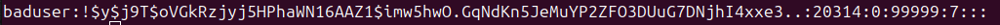

---

## 23. Delete the baduser account

```bash
sudo userdel baduser
```

---

## 24. Delete the badgroup supplementary group.

```bash
groupdel badgroup
```

---

## 25. Create a folder myteam in your home directory and change its permission to read-only for the owner.

- Symbolic method (this will keep group and others permissions as it is)

```bash
sudo chmod u=r myteam/
```

- Numeric method (this will make group and others have no permissions)

```bash
sudo chmod 400 myteam/
```

---

## 26. Log out and log in as another user and try to `cd` into myteam. What happens?

- It gives `permission denied`

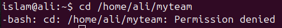

---

## 27. What are the minimum permissions needed for the following:

| Command | Source Directory | Source File | Target Directory |
| --- | --- | --- | --- |
| copy directory | x, r | r | x, w |
| copy file | x | r | x, w |
| delete file | x, w | none !!! | N/A |
| change directory | x | N/A | N/A |
| list contents | x, r | N/A | N/A |
| view file content | x | r | N/A |
| modify file | x, r | r, w | N/A |

---

## 28. Create a file with permission 444

```bash
touch myfile
chmod 444 myfile
```

### Try to edit:

- Gives `readonly`

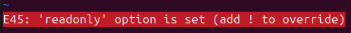

### Try to delete:

- Asks for confirmation

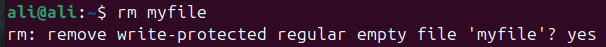

---

## 29. What is the difference between the x permission for:

### A file

- Makes a file executable
- For example: bash scripts or programs

### A directory

- Make you able to `cd` to the directory or access it

---

## 30. Configure a static IP address on your Linux system.

- Editing on my existing DHCP network interface configuration in `/etc/netplan/50-cloud-init.yaml`
- This is for Ubuntu OS

```bash
# This file is generated from information provided by the datasource.  Changes
# to it will not persist across an instance reboot.  To disable cloud-init's
# network configuration capabilities, write a file
# /etc/cloud/cloud.cfg.d/99-disable-network-config.cfg with the following:
# network: {config: disabled}
network:
		version: 2
		renderer: networkd
    ethernets:
        enp3s0:
            dhcp4: no
            address: [192.168.1.20/24]
            routes:
	            - to: default
		            via: 192.168.1.2
		        nameservers:
			        addresses: [8.8.8.8, 8.8.4.4]
```

### For RHEL,  CentOS or Fedora

- use `nmcli` command
- This command creates a new connection called `static-ens224` for the network interface `ens224`

```bash
nmcli connection add con-name static-ens224 type ethernet ifname ens224 ipv4.addresses 192.168.1.55/24 gw4 192.169.1.1 connection.autoconnect yes ipv4.method manual
```

---

## 31. Use the following commands to test and analyze network connectivity to 8.8.8.8:

### `ping`

- This command tests connectivity by sending packets to the destination IP or hostname

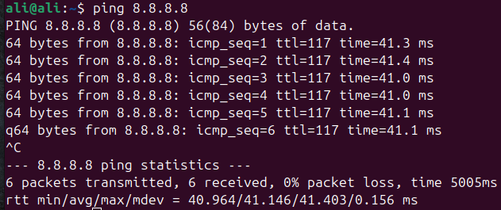

### `traceroute`

- This traces the packet through hops starting with your gateway till it reaches its destination
- We can see that the last hop that replied was number 11
- The rest of the hops are not responding to the `ICMP` packets up to hop 30 which is the maximum hops by default

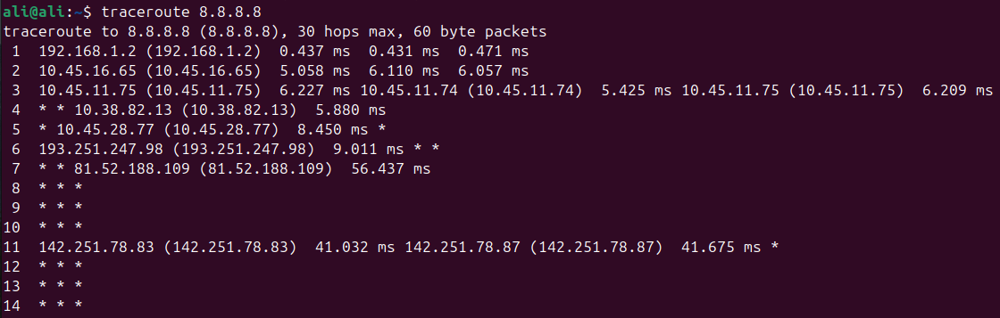

### `nslookup`

- Used to resolve a domain name to IP or vice versa by querying a a DNS Server

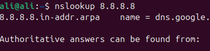

---

## 32. Explain what a firewall is, how to enable it on Linux, and how to allow a specific port through it

- A firewall is a security system that controls incoming and outgoing network traffic for a Linux system
- Enable firewall in Ubuntu

```bash
sudo ufw enable
```

- Allowing SSH port

```bash
sudo ufw allow 22/tcp
```

---

## 33. Background and foreground jobs

### Run `sleep 50` in the background

```bash
sleep 50 &
```

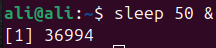

### Run it normally

```bash
sleep 50
```

### Send it to background

- Stop the job first using `ctrl + z`

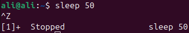

- Then send it to background

```bash
bg %1
```

- Find process ID

```bash
jobs -l
```

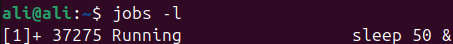

- Kill it (gracefully)

```bash
kill 37275
```