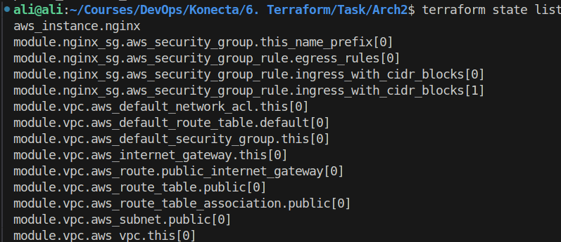
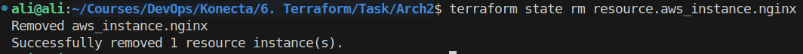

## 1. Create Arch1

### `main.tf`

```hcl
provider "aws" {
  region = var.aws_region
}

resource "aws_vpc" "main" {
  cidr_block = var.vpc_cidr
  tags = {
    Name = var.vpc_name
  }
}

resource "aws_subnet" "public" {
  vpc_id                  = aws_vpc.main.id
  cidr_block              = var.public_subnet_cidr
  map_public_ip_on_launch = true
  availability_zone       = var.public_subnet_az

  tags = {
    Name = var.public_subnet_name
  }
}

resource "aws_subnet" "private" {
  vpc_id            = aws_vpc.main.id
  cidr_block        = var.private_subnet_cidr
  availability_zone = var.private_subnet_az

  tags = {
    Name = var.private_subnet_name
  }
}

resource "aws_internet_gateway" "igw" {
  vpc_id = aws_vpc.main.id
  tags = {
    Name = var.igw_name
  }
}

resource "aws_route_table" "public" {
  vpc_id = aws_vpc.main.id

  route {
    cidr_block = "0.0.0.0/0"
    gateway_id = aws_internet_gateway.igw.id
  }

  tags = {
    Name = var.rt_name
  }
}

resource "aws_route_table_association" "public_assoc" {
  subnet_id      = aws_subnet.public.id
  route_table_id = aws_route_table.public.id
}

resource "aws_eip" "nat_eip" {
  domain = "vpc"
}

resource "aws_nat_gateway" "nat" {
  allocation_id = aws_eip.nat_eip.id
  subnet_id     = aws_subnet.public.id

  tags = {
    Name = "nat-gateway"
  }
}

resource "aws_route_table" "private" {
  vpc_id = aws_vpc.main.id

  route {
    cidr_block     = "0.0.0.0/0"
    nat_gateway_id = aws_nat_gateway.nat.id
  }

  tags = {
    Name = "private-rt"
  }
}

resource "aws_route_table_association" "private_assoc" {
  subnet_id      = aws_subnet.private.id
  route_table_id = aws_route_table.private.id
}

resource "aws_security_group" "nginx_sg" {
  name        = var.sg_name
  description = "Allow SSH and HTTP"
  vpc_id      = aws_vpc.main.id

  ingress {
    description = "SSH"
    from_port   = 22
    to_port     = 22
    protocol    = "tcp"
    cidr_blocks = [var.allowed_ssh_cidr]
  }

  ingress {
    description = "HTTP"
    from_port   = 80
    to_port     = 80
    protocol    = "tcp"
    cidr_blocks = [var.allowed_http_cidr]
  }

  egress {
    from_port   = 0
    to_port     = 0
    protocol    = "-1"
    cidr_blocks = ["0.0.0.0/0"]
  }

  tags = {
    Name = var.sg_name
  }
}

resource "aws_instance" "nginx" {
  ami                    = var.instance_ami
  instance_type          = var.instance_type
  subnet_id              = aws_subnet.private.id
  vpc_security_group_ids = [aws_security_group.nginx_sg.id]
  key_name               = var.key_name

  user_data = <<-EOF
              #!/bin/bash
              apt-get update -y
              apt-get install -y nginx
              systemctl start nginx
              systemctl enable nginx
              EOF

  tags = {
    Name = var.instance_name
  }
}

output "nginx_private_ip" {
  value = aws_instance.nginx.private_ip
}

```

### `variables.tf`

```hcl
variable "aws_region" {
  description = "AWS region to deploy resources"
  type        = string
}

variable "vpc_cidr" {
  description = "CIDR block for the VPC"
  type        = string
}

variable "vpc_name" {
  description = "Name of the VPC"
  type        = string
}

variable "public_subnet_cidr" {
  description = "CIDR block for the public subnet"
  type        = string
}
variable "private_subnet_cidr" {
  description = "CIDR block for the public subnet"
  type        = string
}

variable "public_subnet_name" {
  description = "Name of the public subnet"
  type        = string
}

variable "public_subnet_az" {
  description = "Availability Zone for the subnet"
  type        = string
}

variable "private_subnet_name" {
  description = "Name of the public subnet"
  type        = string
}

variable "private_subnet_az" {
  description = "Availability Zone for the subnet"
  type        = string
}

variable "igw_name" {
  description = "Name of the Internet Gateway"
  type        = string
}

variable "rt_name" {
  description = "Name of the Route Table"
  type        = string
}

variable "sg_name" {
  description = "Name of the Security Group"
  type        = string
}

variable "allowed_ssh_cidr" {
  description = "CIDR block allowed to SSH"
  type        = string
}

variable "allowed_http_cidr" {
  description = "CIDR block allowed to HTTP"
  type        = string
}

variable "instance_ami" {
  description = "AMI ID for the EC2 instance"
  type        = string
}

variable "instance_type" {
  description = "EC2 instance type"
  type        = string
}

variable "instance_name" {
  description = "Name of the EC2 instance"
  type        = string
}

variable "key_name" {
  description = "Key pair name for EC2"
  type        = string
}

```

### `terraform.tfvars`

```hcl
aws_region       = "us-east-1"

vpc_cidr         = "10.0.0.0/16"
vpc_name         = "Konecta-vpc"

public_subnet_cidr      = "10.0.2.0/24"
public_subnet_name      = "public-subnet"
public_subnet_az        = "us-east-1a"

private_subnet_cidr      = "10.0.4.0/24"
private_subnet_name      = "private-subnet"
private_subnet_az        = "us-east-1a"

igw_name         = "main-igw"
rt_name          = "public-rt"

sg_name          = "nginx-sg"
allowed_ssh_cidr = "0.0.0.0/0"
allowed_http_cidr= "0.0.0.0/0"

instance_ami     = "ami-0360c520857e3138f"
instance_type    = "t2.micro"
instance_name    = "nginx-server"
key_name         = "vockey3"

```

---

## 2. Research Modules

- **Reusability** – modules let you package common infrastructure patterns (like a VPC or EC2 setup) and reuse them across multiple projects or environments.
- **Maintainability** – changes are made in one place (the module), and they automatically propagate wherever it’s used, reducing duplication.
- **Scalability** – modules make it easy to spin up consistent environments (dev, staging, prod) without rewriting code.
- **Collaboration** – modules provide a clear structure, making Terraform code easier to understand, share, and review in teams.

---

## 3. Create Arch 2 Using Modules

### `main.tf`

```hcl
module "vpc" {
  source = "terraform-aws-modules/vpc/aws"

  name = "konecta2-vpc"
  cidr = var.vpc_cidr

  azs             = [var.availability_zone]
  public_subnets  = [var.public_subnet_cidr]
}

module "nginx_sg" {
  source = "terraform-aws-modules/security-group/aws"
  version = "5.1.0"

  name        = "nginx-private-sg"
  description = "Security group for private Nginx instance"
  vpc_id      = module.vpc.vpc_id

  ingress_with_cidr_blocks = [
    {
      rule        = "http-80-tcp"
      cidr_blocks = var.vpc_cidr
      description = "Allow HTTP from within VPC"
    },
    {
      from_port   = 22
      to_port     = 22
      protocol    = "tcp"
      cidr_blocks = var.vpc_cidr
      description = "Allow SSH only from inside VPC"
    }
  ]

  egress_rules = ["all-all"]
}

resource "aws_instance" "nginx" {
  ami                         = var.ami
  instance_type               = var.instance_type
  subnet_id                   = module.vpc.public_subnets[0]
  vpc_security_group_ids      = [module.nginx_sg.security_group_id]
  associate_public_ip_address = true
  key_name                    = var.key_name

  user_data = <<-EOF
            #!/bin/bash
            apt-get update -y
            apt-get install -y nginx
            systemctl start nginx
            systemctl enable nginx

              EOF

  tags = {
    Name = var.instance_name
  }
}
output "public_instance_id" {
  value = aws_instance.nginx.public_ip
}
```

### `variables.tf`

```hcl
variable "aws_region" {
  description = "AWS region to deploy resources"
  type    = string
}

variable "vpc_cidr" {
  description = "CIDR block for the VPC"
}

variable "public_subnet_cidr" {
  description = "CIDR block for the public subnet"
  type    = string
}

variable "availability_zone" {
  description = "Availability Zone for the subnet"
  type    = string
}

variable "instance_type" {
  description = "EC2 instance type"
  type    = string
}

variable "ami" {
  description = "AMI ID for the EC2 instance"
  type    = string
}

variable "key_name" {
  description = "Key pair name for EC2"
  type = string
}

variable "instance_name" {
  description = "Name of the EC2 instance"
  type    = string
}
```

### `terraform.tfvars`

```hcl
aws_region         = "us-east-1"
vpc_cidr           = "10.0.0.0/16"
public_subnet_cidr = "10.0.1.0/24"
availability_zone  = "us-east-1a"

instance_type = "t2.micro"
ami           = "ami-0360c520857e3138f"
key_name      = "vockey3"
instance_name = "public-nginx"
```

---

## 4. Remote State file

### `provider.tf`

```hcl
provider "aws" {
  region = var.aws_region
}
terraform {
  backend "s3" {
    bucket = "konecta-terraform-task-ali"
    key    = "task/state.tfstate"
    region = "us-east-1"
  }
}
```

---

## 5. Execute `terraform destroy` without deleting EC2

### List resources in the state

```bash
terraform state list
```



### We can Remove EC2 resource from the state file

```bash
terraform state rm resource.aws_instance.nginx
```



---

## 6. Prevent NAT Gateway Deletion

### We can add a terraform lifecycle to control the resource deletion

```hcl
resource "aws_nat_gateway" "nat" {
  allocation_id = aws_eip.nat_eip.id
  subnet_id     = aws_subnet.public.id

  tags = {
    Name = "nat-gateway"
  }
  lifecycle {
    prevent_destroy = true
  }
}
```